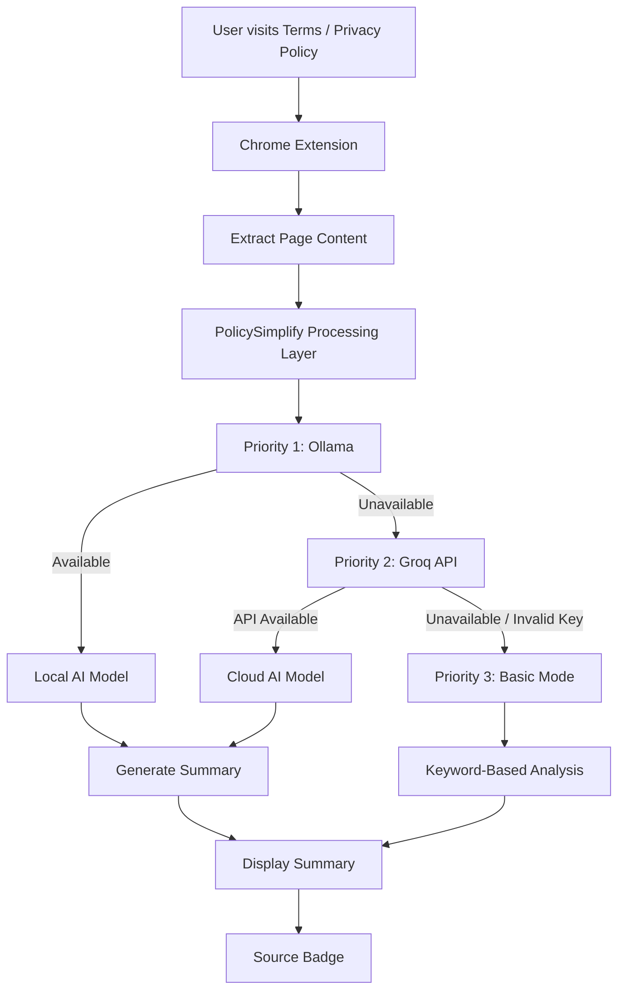

# PolicySimplify — Ollama + Groq Edition

> **An AI-powered Chrome extension that simplifies lengthy Terms of Service and Privacy Policy pages using local AI, cloud AI, and a reliable keyword-based fallback.**

PolicySimplify helps users understand long and complicated legal/policy documents without having to manually read hundreds of lines of text.

The extension follows a **three-tier intelligent fallback architecture**:

**Ollama (Local AI) → Groq API (Cloud AI) → Basic Mode (Keyword-based fallback)**

This ensures that the extension can continue producing useful results even when an AI service is unavailable.

---

## 1. The Problem

Terms of Service, Privacy Policies, Cookie Policies, and other legal documents are often:

- Extremely long
- Difficult to understand
- Written using complex legal terminology
- Time-consuming to read
- Easy for users to simply skip

As a result, users often accept these policies without actually understanding what they are agreeing to.

### The core problem

> **How can users quickly understand the important information in lengthy policy documents without manually reading the entire document?**

---

## 2. Our Solution

**PolicySimplify** is a Chrome extension designed to automatically extract and summarize important information from Terms of Service and Privacy Policy pages.

The extension uses a layered AI strategy.

### Tier 1 — Ollama

The extension first attempts to use a locally running Ollama model.

This provides:

- Local AI processing
- No cloud API dependency
- Better privacy
- No API cost
- Offline AI capability when the required model is available

### Tier 2 — Groq

If Ollama is unavailable, the extension automatically attempts to use the Groq API.

This provides:

- Fast cloud-based AI inference
- High-quality summaries
- A backup when local AI is unavailable

A Groq API key is optional and can be entered directly through the extension popup.

### Tier 3 — Basic Mode

If neither Ollama nor Groq is available, PolicySimplify does not simply stop working.

Instead, it falls back to a **keyword-based analysis mode** that identifies important policy-related terms and sections.

### The complete fallback flow

```text
User opens a Policy Page
          ↓
    PolicySimplify
          ↓
    Extract Page Text
          ↓
   ┌──────┴──────┐
   ↓             ↓
 Ollama       Ollama unavailable
   ↓             ↓
Success?       Groq API
   ↓             ↓
   Yes        Success?
   ↓             ↓
Summary         Yes
                  ↓
               Summary
                  ↓
          If Groq unavailable
                  ↓
           Basic Mode
                  ↓
        Keyword-based Analysis
```

This makes the extension **fault tolerant** and gives the user a useful result even when AI services are unavailable.

---

# 3. Architecture

PolicySimplify follows a simple client-side Chrome Extension architecture with a three-level processing pipeline.



### Processing Flow

1. The user opens a Terms of Service or Privacy Policy page.
2. The extension extracts the relevant page text.
3. PolicySimplify attempts to process the content using Ollama.
4. If Ollama is unavailable, Groq is used as the backup.
5. If both AI options fail, Basic Mode performs keyword-based analysis.
6. The generated result is displayed in the extension popup.
7. A source badge indicates which processing method generated the result.

---

# 4. Tech Stack

| Technology | Purpose |
|---|---|
| **HTML** | Chrome extension popup structure |
| **CSS** | Popup styling and UI |
| **JavaScript** | Extension logic and processing pipeline |
| **Chrome Extension APIs** | Browser integration |
| **Ollama** | Local AI inference |
| **Phi-3 / Mistral / Gemma2** | Local language models |
| **Groq API** | Cloud AI fallback |
| **Chrome Storage API** | Secure local storage of the optional Groq API key |
| **Keyword Analysis** | Final fallback when AI services are unavailable |

### AI Processing Strategy

```text
                    PolicySimplify
                          │
              ┌───────────┴───────────┐
              │                       │
        Local Processing        Cloud Processing
              │                       │
           Ollama                   Groq
              │                       │
       Local AI Model          Cloud AI Model
              │                       │
              └───────────┬───────────┘
                          │
                    Basic Mode
                          │
                 Keyword Analysis
```

---

# 5. Installation and Setup

## 5.1 Set Up Ollama — Tier 1

Install Ollama using the official Ollama website.

After installation, pull a local model:

```bash
ollama pull phi3
```

Other supported model options include:

```text
mistral
phi3
gemma2
```

Smaller models generally run faster on systems with limited hardware resources.

If you use a different model, update the `OLLAMA_MODEL` value in `popup.js`.

---

## 5.2 Allow the Chrome Extension to Communicate with Ollama

By default, Ollama may block requests from unknown browser origins.

The Chrome extension therefore needs permission to communicate with the local Ollama server.

### macOS / Linux

```bash
export OLLAMA_ORIGINS="chrome-extension://*"
ollama serve
```

### Windows PowerShell

```powershell
$env:OLLAMA_ORIGINS="chrome-extension://*"
ollama serve
```

Keep Ollama running in the background while using the extension.

---

# 6. Set Up Groq — Tier 2

Groq acts as the cloud-based backup when Ollama is unavailable.

Create a Groq API key through the Groq Console.

The key will have a format similar to:

```text
gsk_...
```

### Adding the key

1. Open the PolicySimplify extension.
2. Expand **"Groq API key (optional, used if Ollama isn't running)"**.
3. Paste your Groq API key.
4. Click **Save key**.

The key is stored using:

```javascript
chrome.storage.local
```

The API key is therefore not stored inside the project source files.

> **Never hard-code your Groq API key inside `popup.js` before uploading the project to GitHub.**

If Groq is not configured, the extension will simply continue to Basic Mode when Ollama is unavailable.

---

# 7. Load the Chrome Extension

1. Open Chrome.
2. Navigate to:

```text
chrome://extensions
```

3. Enable **Developer mode**.
4. Click **Load unpacked**.
5. Select the PolicySimplify project folder.
6. Pin the extension to the Chrome toolbar.

The extension is now ready to use.

---

# 8. Features

### 🤖 Local AI Summarization

Uses Ollama to process policy documents locally.

### ⚡ Groq AI Fallback

Automatically switches to Groq when Ollama is unavailable.

### 🔎 Basic Mode

Provides keyword-based analysis when both AI options are unavailable.

### 🔄 Automatic Fallback

The extension automatically moves through the processing tiers:

```text
Ollama
   ↓
Groq
   ↓
Basic Mode
```

No manual switching is required.

### 🔐 Local API Key Storage

The optional Groq API key is stored using Chrome's local storage mechanism instead of being written into the project source code.

### 🏷️ Processing Source Indicator

The extension displays a source badge indicating how the result was generated.

- 🟢 **Ollama — Local AI**
- 🔵 **Groq — Cloud AI**
- 🟡 **Basic Mode — Keywords**

### 🌐 Chrome Extension Integration

Works directly from the browser while users are viewing policy pages.

---

# 9. How to Use

1. Open any Terms of Service or Privacy Policy page.
2. Click the PolicySimplify extension icon.
3. Click **Summarize This Page**.
4. The extension extracts the relevant page content.
5. The extension attempts Ollama first.
6. If Ollama is unavailable, Groq is attempted.
7. If both AI services are unavailable, Basic Mode is activated.
8. The summary is displayed inside the extension.

The status text indicates which processing tier is currently being attempted.

---

# 10. Testing the Three Processing Tiers

## Test Ollama

Make sure Ollama is running:

```bash
ollama serve
```

Then use:

**Extension → Summarize This Page**

The result should display:

```text
Ollama — Local AI
```

---

## Test Groq Fallback

Stop Ollama:

```text
Ctrl + C
```

Then use the extension again.

The extension should automatically move to:

```text
Ollama
   ↓
Groq
```

The result should display:

```text
Groq — Cloud AI
```

---

## Test Basic Mode

Disable Ollama and make Groq unavailable by either:

- Removing the Groq API key
- Using an invalid Groq API key
- Disconnecting from the internet

The extension should finally fall back to:

```text
Basic Mode — Keywords
```

This confirms that all three processing tiers are working correctly.

---

# 11. Screenshots

The following screenshots demonstrate the extension working with both AI processing methods.

## Ollama — Local AI

### GitHub Terms of Service


### Stack Exchange Privacy Policy


---

## Groq — Cloud AI

### GitHub Terms of Service


### Stack Exchange Privacy Policy


---

## Recommended Screenshot Folder

Keep the screenshots inside the repository:

```text
FSD-2/
│
├── images/
│   ├── ollama-github.png
│   ├── ollama-stackexchange.png
│   ├── groq-github.png
│   └── groq-stackexchange.png
│
├── manifest.json
├── popup.html
├── popup.js
├── styles.css
└── README.md
```

This allows GitHub to render the screenshots directly inside the README.

---

# 12. Project Structure

```text
PolicySimplify/
│
├── images/
│   ├── ollama-github.png
│   ├── ollama-stackexchange.png
│   ├── groq-github.png
│   └── groq-stackexchange.png
│
├── manifest.json
├── popup.html
├── popup.js
├── styles.css
└── README.md
```

### `manifest.json`

Defines the Chrome extension configuration, permissions, metadata, and entry points.

### `popup.html`

Defines the user interface displayed when the extension icon is clicked.

### `popup.js`

Contains the core extension logic, including:

- Page text extraction
- Ollama communication
- Groq API communication
- Fallback logic
- Keyword-based processing
- Result generation
- Source status handling

### `styles.css`

Controls the visual appearance and layout of the extension popup.

### `README.md`

Contains project documentation, installation instructions, architecture, features, and screenshots.

### `images/`

Contains screenshots demonstrating the working extension.

---

# 13. Key Design Principle

The main design principle behind PolicySimplify is **reliability through graceful degradation**.

Instead of depending on a single AI service:

```text
Single AI dependency
        ↓
Service unavailable
        ↓
Application fails
```

PolicySimplify uses:

```text
             Ollama
                ↓
        If unavailable
                ↓
              Groq
                ↓
        If unavailable
                ↓
          Basic Mode
                ↓
          Useful Result
```

This makes the extension more resilient and allows users to continue receiving useful information even when an AI service is unavailable.

---

# 14. Closing Notes

PolicySimplify demonstrates how AI can be integrated into a practical browser-based application while maintaining a reliable fallback strategy.

The project combines:

- **Local AI inference**
- **Cloud AI inference**
- **Browser extension development**
- **Automatic fallback handling**
- **Client-side storage**
- **Keyword-based text analysis**

The three-tier architecture provides a balance between **privacy, performance, availability, and usability**.

The goal is simple:

> **Make complicated policies easier to understand, without forcing users to read every line.**

---

## Future Improvements

Potential future enhancements include:

- Support for more local Ollama models
- Better policy-section detection
- Risk-level identification
- Highlighting potentially important clauses
- Privacy and data-collection warnings
- Side-by-side original and summarized content
- Improved keyword-based analysis
- Multi-language policy summarization
- Exporting summaries
- Improved accessibility and UI customization

---

## Project Status

**Status:** Working Prototype

**AI Processing:**

```text
✅ Ollama — Local AI
✅ Groq — Cloud AI Fallback
✅ Basic Mode — Keyword Fallback
```

**Platform:**

```text
Chrome Extension
```